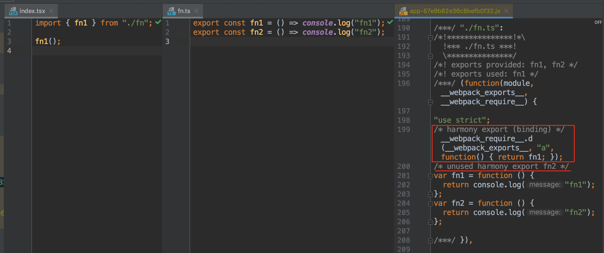

# Tree Shaking

Tree Shaking 已经出现很久了，想必大家或多或少都听说过它。这项技术可以帮助我们删除项目中没有用到的模块，从而减少打包出来的代码量。我也在项目上用了很长时间，希望通过这篇文章跟大家分享我踩过的坑，并从原理和实践两个方面，对这项技术做一个系统的整理。


## 为什么需要 Tree  Shaking？

Tree  Shaking 的字面意思是「摇树」，就是将项目中一些没有用到的模块「摇」掉。在实际场景中，一个文件模块可能会导出多个函数，但其中只有一个被用到了，其他没有被用到的函数就成为了「死代码」。死代码就像树上的枯叶，不仅毫无用处，而且还会增加树的负担，因此我们需要把它「摇」掉，不让死代码进入最终的打包文件。

有的人可能会说，我把没用到的模块删了不就好了，为什么还需要 Tree Shaking？且不说三方依赖库中也会有很多没有用到的模块，那些随着项目迭代而不再需要的方法，真的还会有人记得去删除吗？

有的人又说了，我们可以使用 UglifyJS 这样的工具来做死代码消除（Dead Code Elimination）。那些对应用程序不会造成任何影响或者不可达的代码会被删除，就像下面这样：


既然 UglifyJS 可以消除死代码，为什么还需要 Tree Shaking？原因是 UglifyJS 目前不能跨文件去做死代码消除。UglifyJS 会对文件的代码进行静态分析，然后将死代码从抽象语法树（AST）中删除。静态分析是指不运行代码，只从字面量上对代码进行分析。因此 require 和 export 相关的函数不会被运行，无法得知文件 require 或者 export 了哪些模块。另外，UglifyJS 只会对单个文件的 AST 进行分析，无法得知 export 的模块是否会被其他文件使用。


因此，在下面这种跨文件的场景下，UglifyJS 无法将没有用到的函数 `fn2` 消除。


但 Tree Shaking 可以帮我们解决这个问题，接下来就让我们一起来看看 Tree Shaking 是如何解决这个问题的。


## Tree Shaking 的原理是什么？

简单来说，Tree Shaking 的原理就是对你 import 的代码进行静态分析，如果发现没有被用到的部分就不再 export。





在上面的例子中，fn 文件 export 了两个函数 `fn1` 和 `fn2`，但是只有 `fn1` 被用到了。Tree Shaking 对代码进行静态分析，发现 `fn2` 没有被任何地方使用到，于是就不再 export `fn2` ，这样 `fn2` 就成为了死代码，在之后 Uglify 时就会被删除。


```typescript
// 伪代码
export const fn1 = () => console.log("fn1");
const fn2 = () => console.log("fn2"); // Dead Code
```


不过这一切都依赖于 ES6 模块的静态结构特性：

1. 在编译时就可以明确知道 import 或 export 了哪些模块。
2. 只能在文件顶层 import 或 export 模块，不能在条件语句中使用。
3. import 或 export 的模块名只能是字符串常量。
4. export 导出的模块是一个值的引用，而非值的拷贝。

在 ES6 模块出现之前，我们通常使用 CommonJS 模块来导入和导出模块。通过 require 方法可以动态导入一个模块，但是只有在运行时才能确定导入的模块是什么，因此无法进行静态分析。由于静态结构特性，ES6 模块的依赖关系在编译时就能够明确，为 Tree Shaking 进行静态分析打下了坚实的基础。


## Tree Shaking 为什么失效了？

Webpack 升级之后可以 import * as xxx?


只有在 production 模式下才会生效。


UglifyJS 不会跨文件去做 DCE，如果有 Scope Hoisting 还需要 Tree Shaking 吗？


UglifyJS 为什么不能跨文件去做 DCE？

标记 sideEffect

标记 PURE

tree shaking 并不删除死代码，只是标记

Roll up 和 Webpack 对比


// harmony export 是什么？

// import * as xxx 

// import React from 'react' 会导入所有模块吗？

// const abc = require("abc"); 会导入所有模块吗？

// webpack 是如何识别 unused xxx 标记的？


- node_modules 里面的代码
- 非 node_modules 的代码

