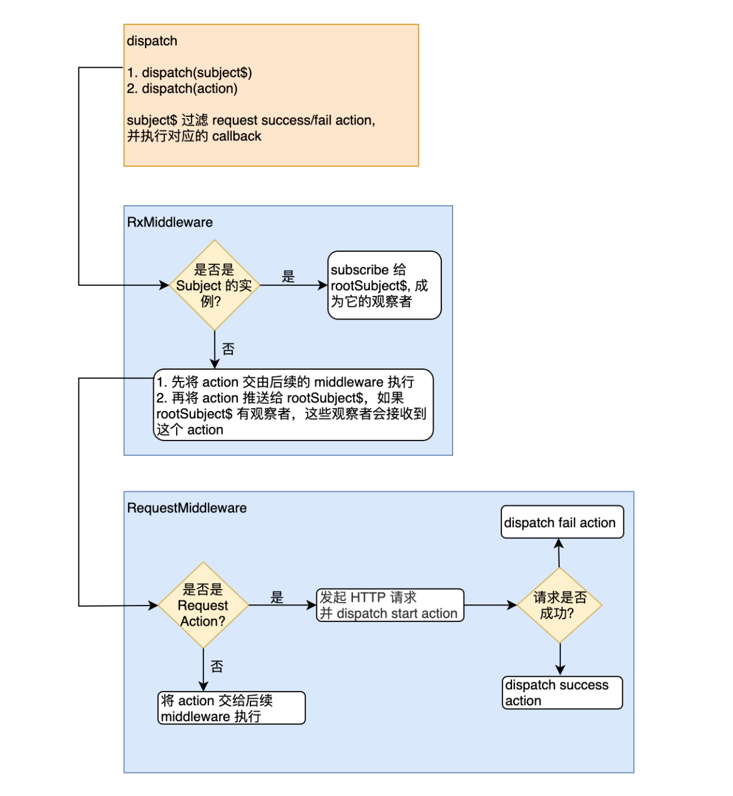

# 基于 React 和 Redux 的 API 集成解决方案


# 1. 统一处理 HTTP 请求


## 1.1 为什么要这样做？

我们可以直接通过 fetch 或者 XMLHttpRequest 发起 HTTP 请求。但是，如果在每个调用 API 的地方都采用这种方式，可能会产生大量模板代码，而且很难应对一些业务场景：

- 如何为所有的请求添加 loading 动画？

- 如何统一显示请求失败之后的错误信息？

- 如何实现 API 去重？
- 如何通过 Google Analytics 追踪请求？

因此，为了减少模板代码并应对各种复杂业务场景，我们需要对 HTTP 请求进行统一处理。


## 1.2 如何设计和实现？

通过 redux，我们可以将 API 请求 「action 化」。换句话说，就是将 API 请求转化成 redux 中的 action。通常来说，一个 API 请求会转化为三个不同的 action: request action、request start action、request success/fail action。分别用于发起 API 请求，记录请求开始、请求成功响应和请求失败的状态。然后，针对不同的业务场景，我们可以实现不同的 middleware 去处理这些 action。


### 1.2.1 Request Action

redux 的 dispatch 是一个同步方法，默认只用于分发 action (普通对象)。但通过 middleware，我们可以 dispatch 任何东西，比如 function (redux-thunk) 和 observable，只要确保它们被拦截即可。

要实现异步的 HTTP 请求，我们需要一种特殊的 action，本文称之为 **request action** 。request action 会携带请求参数的信息，以便之后发起 HTTP 请求时使用。与其他 action 不同的是，它需要一个 **request** 属性作为标识。其定义如下：


```typescript
interface IRequestAction<T = any> {
  type: T
  meta: {
    request: true // 标记 request action
  };
  payload: AxiosRequestConfig; // 请求参数
}
```


redux 的 action 一直饱受诟病的一点，就是会产生大量模板代码而且纯字符串的 type 也很容易写错。所以官方不推荐我们直接使用 action 对象，而是通过 **action creator** 函数来生成相应的 action。比如社区推出的 redux-actions，就能够帮助我们很好地创建 action creator。参考它的实现，我们可以实现一个函数 `createRequestActionCreator` ，用于创建如下定义的 action creator:


```typescript
interface IRequestActionCreator<TReq, TResp = any, TMeta = any> {
  (args: TReq, extraMeta?: TMeta): IRequestAction;

  TReq: TReq;   // 请求参数的类型
  TResp: TResp; // 请求响应的类型
  $name: string; // request action creator 函数的名字
  toString: () => string;
  start: {
    toString: () => string;
  };
  success: {
    toString: () => string;
  };
  fail: {
    toString: () => string;
  };
}
```


在上面的代码中，TReq 和 TResp 分别表示 **请求参数的类型** 和 **请求响应的类型**。它们保存在 request action creator 函数的原型上。这样，通过 request action creator，我们就能迅速知道一个 API 请求参数的类型和响应数据的类型。


```typescript
const user: typeof getUser.TResp = { name: "Lee", age: 10 };
```


对于 API 请求来说，请求开始、请求成功和请求失败这几个节点非常重要。因为每一个节点都有可能触发 UI 的改变。我们可以定义三种特定 type 的 action 来记录每个异步阶段。也就是我们上面提到的 request start action、request success action 和 request fail action，其定义如下：


```typescript
interface IRequestStartAction<T = any> {
  type: T; // xxx_START
  meta: {
    prevAction: IRequestAction; // 保存其对应的 reqeust action
  };
}

interface IRequestSuccessAction<T = any, TResp = any> {
  type: T; // xxx_SUCCESS
  payload: AxiosResponse<TResp>; // 保存 API Response
  meta: {
    prevAction: IRequestAction; 
  };
}

interface IRequestFailAction<T = any> {
  type: T; // xxx_FAIL
  error: true;
  payload: AxiosError; // 保存 Error
  meta: {
    prevAction: IRequestAction; 
  };
}
```


在上面的代码中，我们在 request action creator 的原型上绑定了 `toString` 方法，以及 `start`、 `success` 和 `fail` 属性。因为 action type 是纯字符串，手写很容易出错，所以我们希望通过 request action creator 直接获取它们的 type，就像下面这样：


```typescript
`${getData}` // "GET_DATA"
`${getData.start}` // "GET_DATA_START"
`${getData.success}` // "GET_DATA_SUCCESS"
`${getData.fail}`  // "GET_DATA_FAIL"
```


### 1.2.2 Request Middleware

接下来，我们需要创建一个 middleware 来统一处理 request action。middleware 的逻辑很简单，就是拦截所有的 request action，然后发起 HTTP 请求：

- 请求开始：dispatch xxx_STAT action，方便显示 loading
- 请求成功：携带 API Response，dispatch xxx_SUCCESS action
- 请求失败：携带 Error 信息，dispatch xxx_FAIL action

这里需要注意的是，request middleware 需要「吃掉」request action，也就是说不把这个 action 交给下游的 middleware 进行处理。一是因为逻辑已经在这个 middleware 处理完成了，下游的 middleware 无需处理这类 action。二是因为如果下游的 middleware 也 dispatch request action，会造成死循环，引发不必要的问题。


## 1.3 如何使用？

我们可以通过分发 request action 来触发请求的调用。然后在 reducer 中去处理 request success action，将请求的响应数据存入 redux store。

但是，很多时候我们不仅要发起 API 请求，还要在 **请求成功** 和 **请求失败** 的时候去执行一些逻辑。这些逻辑不会对 state 造成影响，因此不需要在 reducer 中去处理。比如：用户填写了一个表单，点击 submit 按钮时发起 API 请求，当 API 请求成功后执行页面跳转。这个问题用 Promise 很好解决，你只需要将逻辑放到它的 then 和 catch 中即可。然而，将请求 「action化」之后，我们不能像 Promise 一样，在调用请求的同时注册请求成功和失败的回调。

如何解决这个问题呢？我们可以实现一种类似 Promise 的调用方式，允许我们在分发 request action 的同时去注册请求成功和失败的回调。也就是我们即将介绍的 useRequest。


### 1.3.1 useRequest: 基于 React Hooks 和 RXJS 调用请求

为了让发起请求、请求成功和请求失败这几个阶段不再割裂，我们设计了 `onSuccess` 和 `onFail` 回调。类似于 Promise 的 then 和 catch。希望能够像下面这样去触发 API 请求的调用：


```typescript
// 伪代码

useRequest(xxxActionCreator, {
  onSuccess: (requestSuccessAction) => {
    // do something when request success
  },
  onFail: (requestFailAction) => {
    // do something when request fail
  },
});
```


#### 通过 RxJS 处理请求成功和失败的回调

Promise 和 callback 都像「泼出去的水」，正所谓「覆水难收」，一旦它们开始执行便无法取消。如果遇到需要「取消」的场景就会比较尴尬。虽然可以通过一些方法绕过这个问题，但始终觉得代码不够优雅。因此，我们引入了 RxJS，尝试用一种新的思路去探索并解决这个问题。

我们可以改造 redux 的 `dispatch` 方法，在每次 dispatch 一个 action 之前，再 dispatch 一个 `subject$` （观察者）。接着，在 middleware 中创建一个 `rootSubject$` （可观察对象），用于拦截 dispatch 过来的 `subject$`，并让它成为 `rootSubject$` 的观察者。`rootSubject$` 会把 dispatch 过来的 action 推送给它的所有观察者。因此，只需要观察请求成功和失败的 action，执行对应的 callback 即可。





利用 Rx 自身的特性，我们可以方便地控制复杂的异步流程，当然也包括取消。


#### 实现 useRequest Hook

`useRequest` 提供用于分发 request action 的函数，同时在请求成功或失败时，执行相应的回调函数。它的输入和输出大致如下：


```typescript
interface IRequestCallbacks<TResp> {
  onSuccess?: (action: IRequestSuccessAction<TResp>) => void;
  onFail?: (action: IRequestFailAction) => void;
}

export enum RequestStage {
  START = "START",
  SUCCESS = "SUCCESS",
  FAILED = "FAIL",
}

const useRequest = <T extends IRequestActionCreator<T["TReq"], T["TResp"]>>(
  actionCreator: T,
  options: IRequestCallbacks<T["TResp"]> = {},
  deps: DependencyList = [],
) => {
  
  // ...
  
  return [request, requestStage$] as [typeof request, BehaviorSubject<RequestStage>];
};
```


它接收 `actionCreator` 作为第一个参数，并返回一个 **request 函数**，当你调用这个函数时，就可以**分发相应的 request action**，**从而发起 API 请求**。

同时它也会返回一个可观察对象 `requestStage$`（可观察对象） ，用于推送当前请求所处的阶段。其中包括：**请求开始、成功和失败三个阶段**。这样，在发起请求之后，我们就能够轻松地追踪到它的状态。这在一些场景下非常有用，比如当请求开始时，在页面上显示 loading 动画，请求结束时关闭这个动画。

为什么返回可观察对象 `requestStage$` 而不是返回 requestStage 状态呢？如果返回状态，意味着在请求开始、请求成功和请求失败时都需要去 setState。但并不是每一个场景都需要这个状态。对于不需要这个状态的组件来说，就会造成一些浪费（re-render）。因此，我们返回一个可观察对象，当你需要用到这个状态时，去订阅它就好了。

 `options` 作为它的第二个参数，你可以通过它来指定 `onSuccess` 和 `onFail` 回调。onSuccess 会将 request success action 作为参数提供给你，你可以通过它拿到请求成功响应之后的数据。然后，你可以选择将数据存入 redux store，或是 local state，又或者你根本不在乎它的响应数据，只是为了在请求成功时去跳转页面。但无论如何，通过 useRequest，我们都能更加便捷地去实现需求。


```typescript
const [getBooks] = useRequest(getBooksUsingGET, {
  success: (action) => {
    saveBooksToStore(action.payload.data); // 将 response 数据存入 redux store
  },
});

const onSubmit = (values: { name: string; price: number }) => {
  getBooks(values);
};
```


#### 复杂场景

`useRequest` 封装了调用请求的逻辑，通过组合多个 `useRequest` ，可以应对很多复杂场景。


##### 处理多个相互独立的 Request Action

同时发起多个不同的 request action，这些 request action 之间相互独立，并无关联。这种情况很简单，使用多个 `useRequest` 即可。


```typescript
const [requestA] = useRequest(A);
const [requestB] = useRequest(B);
const [requestC] = useRequest(C);

useEffect(() => {
  requestA();
  requestB();
  requestC();
}, []);

```


##### 处理多个相互关联的 Request Action

同时发起多个不同的 request action，这些 request action 之间有先后顺序。比如发起 A 请求，A 请求成功了之后发起 B 请求，B 请求成功了之后再发起 C 请求。

由于 useRequest 会创建发起请求的函数，并在请求成功之后执行 onSuccess 回调。因此，我们可以通过 useRequest 创建多个 request 函数，并预设它们成功响应之后的逻辑。就像 RXJS 中「预铺设管道」一样，当事件发生之后，系统会按照预设的管道运作。


```typescript
// 预先创建所有的 request 函数，并预设 onSuccess 的逻辑
const [requestC] = useRequest(C);

const [requestB] = useRequest(B, {
  onSuccess: () => {
    requestC();
  },
});
const [requestA] = useRequest(A, {
  onSuccess: () => {
    requestB();
  },
});

// 当 requestA 真正调用之后，程序会按照预设的逻辑执行。

<form onSubmit={requestA}>

```


##### 处理多个相同的 request action

同时发起多个完全相同的 request action，但是出于性能的考虑，我们通常会「吃掉」相同的 action，只有最后一个 action 会发起 API 请求。也就是我们前面提到过的 API 去重。但是对于 request action 的回调函数来说，可能会有下面两种不同的需求：

1. 每个相同 request action 所对应的 onSuccess/onFail 回调在请求成功时都会被执行。
1. 只执行真正发起请求的这个 action 所对应的 onSuccess/onFail 回调。

对于第一个场景来说，我们可以判断 action 的 type 和 payload 是否一致，如果一致就执行对应的 callback，这样相同 action 的回调都可以被执行。对于第二个场景，我们可以从 action 的 payload 上做点「手脚」，action 的 payload 放置的是我们发起请求时需要的 request config，通过添加一个 UUID，可以让这个和其他 action「相同」的 action 变得「不同」，这样就只会执行这个 request action 所对应的回调函数。


#### 组件卸载
通常我们会使用 Promise 或者 XMLHttpRequest 发起 API 请求，但由于 API 请求是异步的，在组件卸载之后，它们的回调函数仍然会被执行。这就可能导致一些问题，比如在已卸载的组件里执行 setState。

组件被卸载之后，组件内部的逻辑应该随之「销毁」，我们不应该再执行任何组件内包含的任何逻辑。利用 RxJS，useRequest 能够在组件销毁时自动取消所有逻辑。换句话说，就是不再执行请求成功或者失败的回调函数。


# 2. 存储并使用请求响应的数据

对于 API Response 这一类数据，我们应该如何存储呢？由于不同的 API Response 数据对应用有着不同的作用，因此我们可以抽象出对应的数据模型，然后分类存储。就像我们收纳生活用品一样，第一个抽屉放餐具，第二个抽屉放零食......


按照数据变化的频率，或者说数据的存活时间，我们可以将 API response 大致归为两类：

一类是变化频率非常高的数据，比如排行榜列表，可能每一秒都在发生变化，这一类数据没有缓存价值，我们称之为临时数据（temporary data）。临时数据用完之后会被销毁。

另一类是不常发生变化的数据，我们称之为实体数据（entity），比如国家列表、品牌列表。这一类数据很多时候需要缓存到本地，将它们归为一类更易于做数据持久化。


## 2.1 useTempData


### 2.1.2 背景

通过 useRequest 我们已经能够非常方便的去调用 API 请求了。但是对于大部分业务场景来说，还是会比较繁琐。试想一个非常常见的需求：将 API 数据渲染到页面上。我们通常需要以下几个步骤：


Step1: 组件 mount 时，dispatch 一个 request action。这一步可以通过 useRequest 实现。

Step2: 处理 request success action，并将数据存入 store 中。

Step3: 从 store 的 state 中 pick 出对应的数据，并将其提供给组件。

Step4: 组件拿到数据并渲染页面。

Step5: 执行某些操作之后，用新的 request 参数重新发起请求。

Step6: 重复 Step2、Step3、Step4。


如果每一次集成 API 都要通过上面的这些步骤才能完成，不仅会浪费大量时间，也会生产大量模板代码。并且，由于逻辑非常地分散，我们无法为它们统一添加测试，因此需要在每个使用的地方单独去测。可想而知，开发效率一定会大打折扣。

为了解决这个问题，我们抽象了 useTempData。之前也提到过 temp data 的概念，其实它就是指页面上的临时数据，通常都是「阅后即焚」。我们项目上通过 API 请求获取的数据大部分都是这一类。useTempData 主要用于在组件 mount 时自动获取 API 数据，并在组件 unmount 时自动销毁它们。


### 2.1.3 输入和输出

useTempData 会在组件 mount 时自动分发 request action，当请求成功之后将响应数据存入 redux  store，然后从 store 提取出响应数据，将响应数据提供给外部使用。当然，你也可以通过配置，让 useTempData 响应请求参数的变化，当请求参数发生变化时，useTempData 会携带新的请求参数重新发起请求。

其核心的输入输出如下：


```typescript
export const useTempData = <T extends IRequestActionCreator<T["TReq"], T["TResp"]>>(
  actionCreator: T,
  args?: T["TReq"],
  deps: DependencyList = [],
) => {
  // ...
  return [data, requestStage, fetchData] as [
    typeof actionCreator["TResp"],
    typeof requestStage,
    typeof fetchData,
  ];
};
```


它接收 `actionCreator` 作为第一个参数，用于创建相应的 request action。当组件 mount 时，会自动分发 request action。`args` 作为第二个参数，用于设置请求参数。 `deps` 作为第三个参数，当它发生变化时，会重新分发 request action。

同时，它会返回 API 响应的数据 `data`、表示请求当前所处阶段的 `requestStage`  以及用于分发 request action 的函数 `fetchData` 。


使用起来也非常方便，如果业务场景比较简单，集成 API 就是一行代码的事：


```typescript
const [books] = useTempData(getBooksUsingGET, { bookType }, [bookType]);

// 拿到 books 数据，渲染 UI
```


### 2.1.4 实现思路

useTempData 基于 useRequest 实现。在组件 mount 时分发 request action，然后在请求成功的回调函数 onSuccess 中再分发另一个 action，将请求响应的数据存入 redux store。


```typescript
const [fetchData] = useRequest(actionCreator, {
  success: (action) => {
    dispatch(updateTempData(groupName, reducer(dataRef.current, action))),
  },
});

useEffect(() => {
  fetchData(args as any);
}, deps);
```


### 2.1.5 组件卸载

当组件卸载时，如果 store 的 state 已经保存了这个 request action 成功响应的数据，useTempData 会自动将它清除。发起 API 请求之后，如果组件已经卸载，useTempData 就不会将请求成功响应的数据存入 redux store。


## 2.2 useEntity

基于 useTempData 的设计，我们可以封装 useEntity， 用于统一处理 entity 这类数据。这里不再赘述。

# 3. 自动生成代码


利用代码生成工具，我们可以通过 swagger 文档自动生成 request  action creator 以及接口定义。并且，每一次都会用服务端最新的 swagger json 来生成代码。这在接口变更时非常有用，只需要一行命令，就可以更新接口定义，然后通过 TypeScript 的报错提示，依次修改使用的地方即可。

同一个 swagger 生成的代码我们会放到同一个文件里。在多人协作时，为了避免冲突，我们会将生成的 request action creator 以及接口定义按照字母顺序进行排序，并且每一次生成的文件都会覆盖之前的文件。因此，我们在项目上还硬性规定了：生成的文件只能自动生成，不能够手动修改。


# 4. 最后


自动生成代码工具为我们省去了很大一部分工作量，再结合我们之前讲过的 useRequest、useTempData 和 useEntity，集成 API 就变成了一项非常轻松的工作。


-----

__问题__:


在同一个组件中，连续调用了多次 `useRequest` 生成的 `request` 方法。比如连续上传多个文件。可能会导致 `onSuccess ` 只执行一次的问题。因为在 `useReqeust` 中有这样一段代码：


```tsx
lastActionRef.current = action;
```


连续调用两次 request，我们这里用 requestA 和 requestB 来表示。调用 requestB 时，lastAction 就被 B action  给覆盖了，导致在比较 `requestSuccessAction.meta.previousAction.payload` 和 `lastActionRef.current.payload` 不相等（两次请求 type 相同，但是 payload 不同）。这样就会导致某次 request 的 success callback 无法被执行。


```typescript
isEqual(requestSuccessAction.meta.previousAction.payload, lastActionRef.current.payload)
```


但是有时候，我们又必须去比较 `payload` 是否相同。比如一个页面有 A 和 B 两个组件，这个两个组件调用了同一个 API，但是请求参数不同。A 和 B 组件中都分别使用了 `useReqeust` 去发起请求。如果不比较 payload，那么 A request 成功之后，就可能调用 A 和 B 中两个 useRequest 中的 onSuccess 回调（因为 A request 和 B request 的 type 相同），从而引发 Bug。


