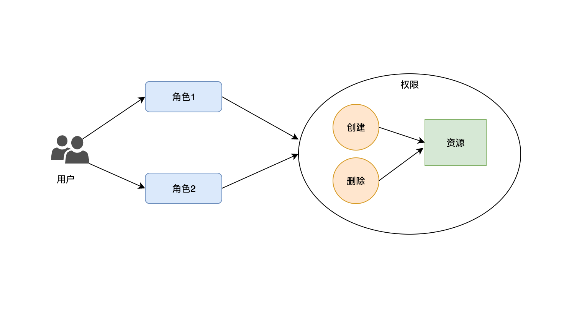

当我们讨论「前端应用的权限控制」时，不是在讨论如何去「控制权限」，而是在说如何保证「更好的用户体验」。因为前端本就无法实现真正的权限控制。大部分时候，前端应用的权限控制其实就是：根据不同的权限显示或隐藏某个页面以及 UI 元素。目的就是提升用户体验，并减少发起无用的 HTTP 请求。RBAC 是目前普遍使用的一种权限模型。本文会讨论如何基于 RBAC 权限模型去实现前端应用的权限控制。


## RBAC 简介

RBAC（Role-Based Access Control）即：基于角色的访问控制。RBAC 认为授权其实就是 who, what, how 三者之间的关系，即 who 对 what 进行 how 操作。简单来说就是某个角色 (who) 对某些资源 (what) 拥有怎样的 (how) 权限。在 RBAC 中，用户只和角色关联，而角色对应了一组权限。通过为不同的用户分配不同的角色，从而让不同的用户拥有不同的权限。相比于 ACL（Access Control List）直接为用户赋予权限的方式，RBAC 通过角色为用户和权限之间架起了一座桥梁，从而简化了用户和权限的关系，让权限配置更易于扩展和维护。



## 前端应用的权限控制

对于前端应用来说，按照权限控制粒度的不同，可以分为页面权限和组件权限：

1. 组件权限控制的粒度更细，可以精确地控制每个 UI 元素显示与否。
2. 页面权限控制的粒度较粗，只能控制到页面层。本质上就是对路由进行权限控制。


### 组件权限控制

刚才也提到了，组件的权限控制粒度很细。因此，我们可能需要为应用中数百个组件添加权限控制。这意味着如果一开始没有设计好组件权限控制的方案，可能会导致应用难以维护，甚至造成灾难性的后果。


#### 一个错误的方案

在最初设计组件权限控制的方案时，我们将组件的显示与否关联到了角色。也就是说通过配置允许访问某个组件的角色列表，去控制某个组件的显示与否。为了方便使用，我们还设计了一个公用组件，用它来包裹每个需要权限控制的组件。如下所示：


```jsx
<OneOfAccessControl permittedRoles={["RoleA", "RoleB", "RoleC"]}>
  <Button />
</OneOfAccessControl>
```


在上面的例子中，只要列表中的任意一个角色有访问按钮组件的权限，就会渲染按钮组件，否则什么也不做。这段代码看起来似乎没什么大问题。但如果此时要新增一个角色，试想会发生什么？我们可能需要在上百个地方去配置新增角色。虽然给项目造成了很大开销，不过好在满足了业务需求。但如果需求是根据动态生成的角色去控制组件的显示与否，又该如何解决呢？比如管理员可以动态创建一个新的角色，那么这个新的角色同样应该参与按钮组件显隐的控制。但是由于按钮组件的显示与否是根据「固定」的角色列表来判定的，因此无法满足「动态」增加或删除角色的需求。


问题的关键就在于：RBAC 权限模型中，角色不是固定的而是动态变化的。我们可以随时增加或者修改一个角色。因此不能将组件的权限控制和角色绑定到一起。


组件的权限控制，其实就是控制组件的显示与否。但有时候组件的显示与否，不仅仅和权限相关，也和数据状态相关：


```jsx
<OneOfAccessControl permittedRoles={["RoleA", "RoleB", "RoleC"]}>
  {age >= 18 && <Button />}
</OneOfAccessControl>;
```


在实际场景中，可能会有很多状态去控制 UI 元素是否显示，再加上权限控制，测试起来十分困难。在使用这个方案的过程中，问题也逐渐暴露出来：

1. 配置 `permittedRoles` 可能出错，且逻辑分散在项目的各个角落，难以维护。
2. 增加角色的成本很大，因为需要修改散落在各个地方的配置。
3. 增加单元测试成本。为了确保每个 UI 组件都正确设置了访问权限，我们需要增加单元测试。但是测试组件是否根据 `permittedRoles` 和状态渲染了正确的 UI，是一笔很大的开销。
4. 前后端权限控制不一致的问题。对于某个角色来说，能看到哪些 UI 元素是由前端控制的，而能够调用哪些接口是由后端决定的。有时候由于沟通协作的问题，可能会出现页面上显示了某个 UI 元素，但是却没有权限调用对应接口的问题。
5. 当某个 UI 元素的权限发生变化时，需要修改前端配置并重新部署。


一个用户有哪些权限，在登录完成之后就已经确定了。也就是说，这个用户能看到页面上的哪些元素也已经确定了。因此可以将所有权限配置放到一个文件中，统一管理起来。比如：


```typescript
export const authConfig = {
  canViewProfile: ["Role_A"],
  canEditProfile: ["Role_B"],
  canDeleteProfile: ["Role_A", "Role_B"],
};
```


然后，在拿到当前用户所拥有的角色之后，将这份配置转化为下面的形式提供给下游组件使用：

 

```typescript
const accesss = {
  canViewProfile: true,
  canEditProfile: false,
  canDeleteProfile: true,
}
```


在使用时，只需要通过一个布尔值去控制按钮是否显示就可以了：


```tsx
const {
  access: { canViewProfile },
} = useContext(AccessControlContext);

canViewProfile && <Button />;
```


通过这种方式将应用中所有权限控制的配置都汇总到一个地方，维护起来更加方便。同时为了保证配置的正确性，我们可以通过简单的 snapshot 测试来覆盖业务场景。在使用时因为逻辑非常简单，甚至不需要再增加额外的单元测试。这个方案只解决了我们刚才提到的两个问题，那其他问题如何解决呢？请接着往下看。


#### BFF

BFF 可以根据权限和数据状态去控制一个元素是否显示。这样前端就不用再关心权限和状态，只需要通过一个布尔值，就能够确定 UI 元素的显示与否。同时也能保证前后端权限控制的一致性。如果权限或状态发生改变，前端也无需重新部署。当然，这个方案也有一些局限性：


1. 需要和后端定义好对应的 API Schema，增加了沟通成本。

2. API 响应字段可能无限膨胀。比如：

   ```json
   {
     "canViewProfile": true,
     "canEditProfile": false,
     "canDeleteProfile": false,
     "canViewHistory": true,
     "canEditHistory": false,
     "canDeleteHistory": false,
     "canCreateReport": false,
     "canViewReport": false,
     "canDeleteReport": false
   }
   ```

3. 因为需求的变化导致前端元素发生改变，字段也可能需要重命名。比如原来的字段名叫 `canViewProfile`，随着需求的变化应该修改为 `canViewProfileAndHistory`，否则就会造成不一致。


#### 通过后端接口配置权限

RBAC 定义了某个角色对某些资源拥有怎样的权限，而通过 RESTful API 我们又可以确定资源以及资源的具体操作类型（GET/POST/PUT/PATCH/DELETE）。因此，一个资源和一个权限可以对应为一个 RESTful API。举个例子，A 角色对 `book` 资源拥有 `delete` 权限，也就是说 A 角色可以调用 `deleteBook` 这个API。因此，一个角色对某些资源拥有怎样的权限，就可以翻译为「一个角色可以调用哪些 API」。如果前端能够知道这个角色能够调用哪些 API，就能够自动显示或隐藏对应的 UI 元素。


```json
{
  "permissions": {
    "GetBook": true,  // GetBook 是指 API 的唯一标识，比如 operationId
    "NewBook": true,
    "UpdateBook": true,
    "DeleteBook": true,
    "ListBook": true
  }
}
```


注意后端返回的不是具体的 URL，而是 API 的唯一标识，所以不会存在暴露应用所有接口的风险，没有安全隐患。


```tsx
const {permissions} = useContext(PermissionsContext);

hasPermission(permissions, "GetBook") && <Button />;
```


权限控制应该对应资源和权限，而非角色。因为角色是动态创建的，对于相同的一组资源来说，不同的角色可能拥有不同的权限。因此，新建一个角色其实就是新建一组资源权限的集合。而在第一个方案中，描述的其实是某个角色是否能看到某个 UI 元素，并没有对应到资源上。因此，每新增一个角色时都会给前端带来很大成本。而通过后端接口来配置权限，将权限和资源对应到 API，在增加新角色时不会造成负担。同时，由于不再需要定义权限控制的接口字段，从而减少了前后端的沟通成本，并且避免了接口字段无限膨胀的问题。


### 页面权限控制

页面的权限控制，其实就是在进行页面导航之前，根据用户当前所具有的权限去判断用户是否能访问某个页面。


1. 页面一定会使用组件，根据组件使用到的接口去推导页面是否显示。
2. 通过配置来开关路由。在前端或者后端来保存这份配置。


## 最后

本文讨论了权限控制的几种方案以供大家参考。但这些方案都有利有弊，希望大家根据实际的业务场景去选择最适合的方案。


------------------

每个需要权限控制的组件，都需要增加相应逻辑。因此为了方便使用，可以通过一些公用组件来帮我们进行权限控制。如果要对一个按钮增加权限控制，只需要在它外面包裹一个组件，然后配置允许访问的角色即可。只要其中任意一个角色被允许，就渲染按钮否则就返回空。


1. 减少前后端沟通成本。比如增加或减少一个用于权限控制的接口字段。
2. 无需增加任何额外字段，只需要通过是否能够使用某个接口，就能判定某个元素是否显示。解决了接口无限膨胀的问题。


最终决定元素的显示与否，可能是权限 + 数据状态。


权限 + 数据状态：

1 对 多：后端 

   1. 无限膨胀

      

表达式：避免服务重启。

后端动态 Render ：解决了无限膨胀的问题、更灵活。但是页面元素相对固定，如果要增加或者修改都很困难。


1 对 1： 前端

1. 状态单独判断。（修改、部署困难）
2. 需求变更的情况。


RBAC 控制的最小单元就是接口。让接口的权限和组件的显示与否一一对应。不会存在和后端不一致的情况。


```typescript
const PermissionsContext = createContext<{ permissions: { [key: string]: true }}>({})

const usePermissions = () => useContext(PermissionsContext).permissions || {}


const mustOneOfPermissions = (...requestActionCreators: { name: string }) => (
  const operationIDs = requestActionCreators.map((p) => p.name)

	return function<TProps>(Comp: ComponentType<TProps>) {
    return (props: TProps) => {
      const permissions = usePermissions()
      
      if (some(operationIDs, (operationID) => permissions[operationID])) {
        return <Comp {...props} />
      }
      
      return null
    }
  }
)


const mustAllOfPermissions = (...requestActionCreators: { name: string }) => (
  const operationIDs = requestActionCreators.map((p) => p.name)

	return function<TProps>(Comp: ComponentType<TProps>) {
    return (props: TProps) => {
      const permissions = usePermissions()
      
      if (every(operationIDs, (operationID) => permissions[operationID])) {
        return <Comp {...props} />
      }
      
      return null
    }
  }
)

const SomeComponent = () => {
  
}
```


## Dynamic Content

和组件化开发的思路是一样的。我们可以进一步抽象，将页面元素划分为可配置的 block，不同的 block 包含不同的类型或对应的配置值，如 Section, Image, Paragraph 等，当然每种类型的 block，是需要前端开发完备的，支持对应配置项。然后我们便可通过 JSON 来描述和存储页面，比如

```jsx
const Page = (
  <>
    <Section>
      <Paragraph content="xxxxxx"/>
      <Image src="http://xxx">
    </Section>
    <Section>
      <Paragraph content="content">
    </Section>
  </>
)
```

可以描述为

```json
[
  {
    "type": "Section",
    "children": [
      {
        "type":"Paragraph",
        "content": "xxxxxx"
      },
      {
        "type":"Image",
        "src": "http://xxx"
      }
    ]
  },
  {
    "type": "Section",
    "children": [
      {
        "type":"Paragraph",
        "content": "content"
      }
    ]
  }
]
```

虽然看上去复杂了不少，但由于 JSON 无关语言，易于传输与存储的特性。我们可以这份 JSON 可存放到服务端，前端获取这一 JSON 配置，渲染最终页面。在一些特殊需求中（RBAC，定向广告），服务进行适当删减，使得显示内容得以动态。

参考: https://www.contentful.com/


## Dynamic Form

同样的，更复杂的表单，也是一样的思路，只是对于 Form，有一个额外的功能点，即表单可能随着用户的输入而变化。

既然是表单，最终是需要提交的，所以一般而言我们会为 Dynamic Form 定义两个部分。

一个是提交数据的声明结构，这个采用 JSON Schema 即可。如提交数据为

```json
{
  "name": "xxx",
  "age": 1,
  "gender": "male"
}
```

我们可以用如下声明表示

```json
{
  "type": "object",
  "properties": {
    "name": {
      "type": "string"，
      "pattern": "[\w]{2,}"，
      "x-error": "名字长度不够"
    },
    "gender": {
      "type": "string",
      "enum": ["male", "female"],
      "x-enum-labels": ["男"，"女"]
    }，
    "age": {
      "type": "number",
      "mininum": 20，
      "x-error": "年龄太小"
    }
  }
}
```

然后前端根据不同的类型，渲染对应的组件，

* `type: "string"` 我们可以用  `TextInput` 渲染，`type: "number"` 我们可以用 `NumberInput` 渲染，我们可以 JSON Schema 的 validations 属性来进行输入检查， 由于 JSON Schema 毕竟是设计来描述数据结构的，对错误的 inline error，我们可以扩展 `error` 来描述。
* `type: "number"` 我们可以用 `NumberInput` 渲染，
* `enum` 我们可以用  `SelectInput` 渲染。同样的，对于选项文本的描述需要我们自己扩展，如上面例子中的 `x-enum-labels` ，


对于响应用户输入变化，JSON Shema 有对应的方案。https://json-schema.org/understanding-json-schema/reference/conditionals.html，如下，男女法定婚龄不同，JSON Schema 可定义为，前端组件做出对应的处理即可。

```json
{
  "type": "object",
  "properties": {
    "name": {
      "type": "string"，
      "pattern": "[\w]{2,}"，
      "x-error": "名字长度不够"
    },
    "gender": {
      "type": "string",
      "enum": ["male", "female"],
      "x-enum-labels": ["男"，"女"]
    }，
    "age": {
      "type": "number"
    }
  },
  "if": {
    "properties": { "gender": { "const": "male" } }
  },
  "then": {
    "properties": { "age": { "mininum": 22 } }
  },
  "else": {
    "properties": { "age": { "mininum": 20 } }
  }
}
```


可是这个方案确实不够强大，对应。

这里还有另一种方式，借鉴自一个地图引擎，https://docs.mapbox.com/mapbox-gl-js/style-spec/#expressions，对于复杂场景，来定义 validation `x-validation` 和 condition `x-when`，还可以支持复杂情况

```json
[expression_name, argument_0, argument_1, ...]

["one", ...]
["all", ...] 
["match", pattern, msg]
["get", path]
["case", defaultResult, case1, result1, ...]
[">", target, v]
[">=", target, v]
["==", target, v]
["<", target, v]
["<=", target, v]
```


```json
{
  "type": "object",
  "properties": {
    "name": {
      "type": "string"，
// if (len(field_value) == 0) return "不能为空"
// if (!(/[\w]{2,}/.text(field_value))) return "名字长度不够"
// return ""      
      "x-validate": [
         "case",
         "",
         ["==", ["len"，"$value"], 0], "不能为空",
         ["not", ["match", "$value", [\w]{2,}"]], "名字长度不够",
      ] 
    },
    "gender": {
      "type": "string",
      "enum": ["male", "female"],
      "x-enum-labels": ["男"，"女"]
    }，
    "age": {
      "type": "number"，
// get(values, "gender") && <Field/>      
      "x-when": [
      	"get", "gender",
      ],
// if (get(values, "gender") == "male" && field_value <= 22) return "年龄太小"
// if (get(values, "gender") == "female" && field_value <= 20) return "名字长度不够"
// return "" 
      "x-validate": [
        "case",
        "",
        ["all",
           ["==", ["get", "$values", "gender"], "male"],
           ["<=", 22]
        ], "年龄太小"],
        ["all",
           ["==", ["get", "$values", "gender"], "female"],
           ["<=", 20]
        ], "年龄太小"],
      ]
    }
  }
}
```

至于如何去解析并运算表达式，这算是函数式编程的别样用法。


权限控制应该对应到它的最小单元，否则难以扩展。


权限控制：

oneOf A, B, C

allOf A,B,C


- 对路由的权限控制

- 局部 UI 组件的显示与否。如果用户没有某个权限，点击某个 button 时会抛出 error message，是否考虑 hide button 或者提示用户？

  

